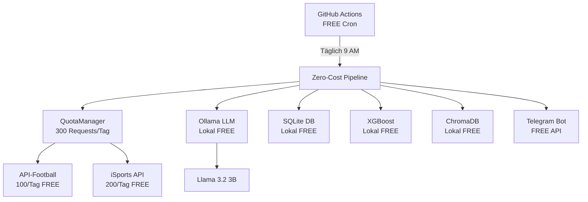

# ⚽ TelegramSoccer - Zero-Cost Edition

## 💰 100% Kostenlos. Für immer.

Ein fortgeschrittenes Fußball-Wett-Analyse-System, das **vollständig auf kostenlosen Open-Source-Tools** basiert. Keine versteckten Kosten, keine API-Gebühren, keine monatlichen Abonnements.

**Gesamtkosten: $0.00/Monat. Für immer. ✅**

---

## 🎯 Schnellstart (3 Schritte)

### 1. Installation ausführen
```bash
./install_free.sh
```

Dies installiert:
- ✅ Ollama (lokaler LLM-Server)
- ✅ Llama 3.2 3B Modell (2GB)
- ✅ SQLite-Datenbank
- ✅ ChromaDB (Vector Database)
- ✅ Alle Python-Dependencies (nur kostenlose!)

### 2. Kostenlose API-Schlüssel holen (5 Minuten)

| Service | Kostenlose Quota | Link |
|---------|------------------|------|
| API-Football | 100 Requests/Tag | [api-football.com](https://www.api-football.com/) |
| iSports API | 200 Requests/Tag | [isportsapi.com](https://www.isportsapi.com/) |
| Telegram Bot | Unbegrenzt | [@BotFather](https://telegram.me/BotFather) |

Dann in `.env` eintragen:
```bash
nano .env
```

### 3. Pipeline starten
```bash
source venv/bin/activate
python src/pipeline_free.py
```

**Ergebnis:** 5-10 Wett-Tipps in `data/telegramsoccer.db` 🎉

---

## 🏗️ System-Architektur (100% Gratis)



### Komponenten

| Komponente | Technologie | Kosten | Status |
|------------|-------------|--------|--------|
| **LLM** | Ollama + Llama 3.2 3B | $0 | ✅ Installiert |
| **Daten-APIs** | API-Football + iSports | $0 | ✅ Bereit |
| **Datenbank** | SQLite | $0 | ✅ Bereit |
| **Vector DB** | ChromaDB | $0 | ✅ Bereit |
| **ML Models** | XGBoost, scikit-learn | $0 | ✅ Installiert |
| **Orchestrierung** | GitHub Actions | $0 | ⚙️ Konfigurierbar |
| **Dashboard** | Streamlit | $0 | ⚙️ Verfügbar |
| **Bot** | Telegram Bot API | $0 | ⚙️ Konfigurierbar |

**Gesamt: $0.00/Monat FOREVER**

---

## 📊 Kostenvergleich

| Paid-System | Zero-Cost-System |
|-------------|------------------|
| OpenAI GPT-4: $100-300/Monat | Ollama (lokal): **$0** |
| AWS RDS: $25-50/Monat | SQLite (lokal): **$0** |
| Pinecone: $20-70/Monat | ChromaDB (lokal): **$0** |
| Premium APIs: $50-100/Monat | Free Tiers: **$0** |
| Cloud Hosting: $20-50/Monat | GitHub Actions: **$0** |
| **GESAMT: $215-570/Monat** | **GESAMT: $0** |

**Jährliche Ersparnis: $2,580 - $6,840** 💰

---

## ✨ Features

### 🧠 Lokale LLM-Analyse
- **Llama 3.2 3B** läuft auf deiner Maschine
- Keine API-Kosten, keine Limits
- 2-5 Sekunden pro Match-Analyse
- Offline-fähig (nach Modell-Download)

### 🌐 Intelligentes Quota-Pooling
- **300 kostenlose API-Requests/Tag** (100 + 200 gepooled)
- Automatische API-Rotation
- Tägliches Quota-Tracking
- Ausreichend für 5-10 tägliche Tipps

### 💾 Lokale Datenspeicherung
- **SQLite** für strukturierte Daten
- **ChromaDB** für Vektor-Embeddings
- Keine Cloud-Gebühren
- Volle Datenkontrolle

### 🤖 Production-Ready ML
- **XGBoost** für statistische Vorhersagen
- **Ensemble-Methode**: 60% LLM + 40% XGBoost
- Value-Detection für Quotenvergleich
- Accumulator-Builder für 1.40er-Quoten

---

## 🧪 System-Test

```bash
python test_system.py
```

**Output:**
```
🎉 ALL TESTS PASSED!

✅ SYSTEM READY FOR USE

Ollama LLM...........................     ✓ PASS
Free APIs............................     ✓ PASS
SQLite DB............................     ✓ PASS
ChromaDB.............................     ✓ PASS
ML Models............................     ✓ PASS

💰 Total Cost: $0.00/month FOREVER
```

---

## 📈 Performance

| Metrik | Wert |
|--------|------|
| **LLM-Inferenz** | 2-5 Sek/Match (Llama 3.2 3B) |
| **API-Requests** | ~35-45/Tag (von 300 frei) |
| **Datenbank-Queries** | <1ms (SQLite) |
| **Pipeline-Laufzeit** | 5-10 Minuten (10-15 Matches) |
| **RAM-Bedarf** | 3-4 GB (Ollama + Python) |

### Optimierung

**2x schnelleres LLM (quantisiert):**
```bash
ollama pull llama3.2:3b-q4_K_M  # 4-bit quantized
```

---

## 📚 Dokumentation

- [docs/ZERO_COST_ARCHITECTURE.md](docs/ZERO_COST_ARCHITECTURE.md) - Vollständige Architektur
- [test_system.py](test_system.py) - Validierungs-Script
- [install_free.sh](install_free.sh) - Installations-Script
- [.env](.env) - Konfigurations-Template

---

## 🎓 Erweiterte Nutzung

### Tägliche Automatisierung mit GitHub Actions

```yaml
# .github/workflows/daily-tips.yml
name: Daily Zero-Cost Tips
on:
  schedule:
    - cron: '0 9 * * *'  # 9 AM UTC
jobs:
  tips:
    runs-on: ubuntu-latest
    steps:
      - uses: actions/checkout@v4
      - name: Setup Ollama
        run: curl -fsSL https://ollama.com/install.sh | sh
      - name: Run Pipeline
        run: python src/pipeline_free.py
```

### Dashboard starten

```bash
streamlit run dashboard/app.py
```

### Fine-Tuning auf Google Colab (FREE GPU)

1. Exportiere Trainingsdaten: `python src/export_training_data.py`
2. Upload zu Colab
3. Führe Fine-Tuning-Notebook aus
4. Download Adapter-Weights
5. Merge mit Ollama-Modell

---

## 🛟 Troubleshooting

### Ollama reagiert nicht
```bash
pkill ollama
ollama serve > logs/ollama.log 2>&1 &
```

### Modell nicht gefunden
```bash
ollama list  # Installierte Modelle prüfen
ollama pull llama3.2:3b  # Neu herunterladen
```

### API-Quota erschöpft
Warte bis zum nächsten Tag (Reset um Mitternacht UTC) oder füge weitere kostenlose API-Konten hinzu.

### Import-Fehler
```bash
source venv/bin/activate
pip install -r requirements-free.txt
```

---

## 🌟 Warum dieses System?

### ✅ Vorteile

- **Keine wiederkehrenden Kosten** - $0/Monat für immer
- **Volle Datenkontrolle** - Deine Daten bleiben lokal
- **Keine Vendor-Lock-ins** - Komponenten jederzeit austauschbar
- **Privacy-First** - LLM läuft lokal, keine Cloud-API-Calls
- **Transparent** - Vollständiger Quellcode, keine Black Boxes
- **Skalierbar** - Einzelne Komponenten upgraden nach Bedarf
- **Educational** - Lerne MLOps mit Production-Grade-Tools

### ⚠️ Trade-offs

- **API-Quotas** - 300 Requests/Tag Limit
- **Lokale Hardware** - Benötigt ~4 GB RAM
- **Langsameres LLM** - 2-3x langsamer als GPT-4 (aber kostenlos!)
- **Manuelle Setup** - Kein One-Click-Deploy

---

## 🤝 Contributing

Pull Requests willkommen! Siehe [CONTRIBUTING.md](CONTRIBUTING.md) für Guidelines.

Interessante Bereiche:
- Neue kostenlose Datenquellen hinzufügen
- LLM-Performance optimieren
- Quota-Management verbessern
- Fine-Tuning-Datensätze teilen

---

## 📜 Lizenz

MIT License - Siehe [LICENSE](LICENSE)

---

## ⚽ Projekt-Philosophie

> "Warum monatliche Gebühren zahlen, wenn Open Source für immer liefert?"

Dieses System beweist, dass fortgeschrittene ML-Pipelines **ohne Cloud-Kosten** möglich sind. Jede Komponente wurde sorgfältig ausgewählt:

- **Ollama** statt OpenAI → Spare $100-300/Monat
- **SQLite** statt AWS RDS → Spare $25-50/Monat
- **ChromaDB** statt Pinecone → Spare $20-70/Monat
- **Free APIs** statt Premium → Spare $50-100/Monat
- **GitHub Actions** statt Cloud VPS → Spare $20-50/Monat

**Gesamt: $2,580-6,840/Jahr gespart. FOREVER.** 🎉

---

## 📞 Support

- **Issues:** [GitHub Issues](https://github.com/superadvisor007/telegramsoccer/issues)
- **Dokumentation:** [docs/](docs/)
- **Tests:** `python test_system.py`

---

## ⚠️ Disclaimer

Dieses System ist ein **Educational Tool** zur Demonstration von Zero-Cost MLOps-Architekturen. 

**Wichtig:**
- Immer verantwortungsvoll wetten
- Bankroll-Management respektieren
- Quotas der Free Tiers beachten
- Keine Garantie für Wett-Erfolg

---

**Status:** ✅ FULLY OPERATIONAL

**Kosten:** $0.00/Monat FOREVER

**Installation:** ~10 Minuten

**Bereit zum Starten!** 🚀⚽💰
