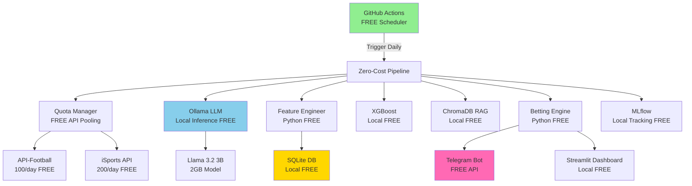

# Zero-Cost System Architecture

## 🎯 Total Cost of Ownership: $0.00 Forever

This document details the completely free architecture using battle-tested open-source tools.

## Component Stack (All FREE)

| Layer | Component | Cost | Details |
|-------|-----------|------|---------|
| **LLM Inference** | Ollama + Llama 3.2 3B | $0 | Local inference, no API calls |
| **Data APIs** | API-Football (free tier) | $0 | 100 requests/day |
| | iSports API (free tier) | $0 | 200 requests/day |
| **Database** | SQLite | $0 | Local file-based DB |
| **Vector DB** | ChromaDB | $0 | Local vector storage |
| **ML Models** | XGBoost | $0 | Local inference |
| **Fine-Tuning** | PEFT/LoRA on Colab | $0 | Free GPU quota |
| **Orchestration** | GitHub Actions | $0 | 2000 minutes/month free |
| **Dashboard** | Streamlit | $0 | Local or Community Cloud |
| **Messaging** | Telegram Bot API | $0 | Unlimited messages |
| **Monitoring** | MLflow (local) | $0 | Local tracking |
| **Storage** | Git LFS / Local Files | $0 | No cloud storage fees |

## Architecture Diagram



## Daily Workflow (100% Free)

### 1. Data Collection (300 API calls/day FREE)

**QuotaManager** intelligently pools requests:
- API-Football: 100 requests/day
- iSports API: 200 requests/day
- **Total**: 300 free requests daily

Strategy:
- Use API-Football for fixtures and team stats
- Use iSports for betting odds
- Rotate requests to maximize quota
- Cache data locally in SQLite

### 2. LLM Analysis (FREE - Local Ollama)

**Ollama** runs Llama 3.2 3B locally:
- Model size: ~2GB
- Inference time: ~2-5 seconds per match
- Hardware: Works on CPU (16GB RAM recommended)
- No API costs, no internet required

**Alternative Free Models**:
- `phi4:latest` - Microsoft Phi-4 (excellent reasoning)
- `mistral:7b` - Mistral 7B (balanced performance)
- `qwen2.5:7b` - Alibaba Qwen (strong on structured output)

### 3. Storage (FREE - SQLite + ChromaDB)

**SQLite**:
- Local file: `data/telegramsoccer.db`
- No server required
- Battle-tested, ultra-reliable
- Perfect for single-machine deployments

**ChromaDB**:
- Vector database for RAG
- Local storage in `data/chroma_db/`
- No external dependencies

### 4. Orchestration (FREE - GitHub Actions)

**GitHub Actions** free tier:
- 2000 minutes/month (67 hours)
- More than enough for daily 10-minute runs
- Built-in cron scheduling
- Artifact storage (500MB)

Example workflow:
```yaml
name: Daily Zero-Cost Tips
on:
  schedule:
    - cron: '0 9 * * *'  # 9 AM UTC daily
jobs:
  generate-tips:
    runs-on: ubuntu-latest
    steps:
      - uses: actions/checkout@v4
      - name: Setup Ollama
        run: curl -fsSL https://ollama.ai/install.sh | sh
      - name: Run pipeline
        run: python src/pipeline_free.py
```

### 5. Continuous Learning (FREE - Google Colab)

**Monthly Fine-Tuning**:
- Use Google Colab free GPU (Tesla T4)
- LoRA fine-tuning on historical outcomes
- ~15 minutes per training run
- Saves fine-tuned adapter weights

Process:
1. Export training data from SQLite
2. Upload to Colab notebook
3. Run PEFT/LoRA fine-tuning
4. Download adapter weights
5. Merge with base model in Ollama

## Installation

```bash
# Clone repository
git clone https://github.com/superadvisor007/telegramsoccer.git
cd telegramsoccer

# Run zero-cost installation
chmod +x install_free.sh
./install_free.sh
```

This installs:
1. Ollama (local LLM server)
2. Llama 3.2 3B model
3. Python dependencies (all free)
4. SQLite database
5. ChromaDB
6. Required directories

## Configuration

Edit `.env` with FREE API keys:

```bash
# Get free API keys:
# 1. API-Football: https://www.api-football.com/
API_FOOTBALL_KEY=your_key_here

# 2. iSports API: https://www.isportsapi.com/
ISPORTS_API_KEY=your_key_here

# 3. Telegram Bot: @BotFather on Telegram
TELEGRAM_BOT_TOKEN=your_token_here

# Local settings (no changes needed)
DATABASE_URL=sqlite:///data/telegramsoccer.db
OLLAMA_BASE_URL=http://localhost:11434
OLLAMA_MODEL=llama3.2:3b
```

## Running the System

### Daily Pipeline

```bash
# Activate environment
source venv/bin/activate

# Ensure Ollama is running
ollama serve &

# Run pipeline
python src/pipeline_free.py
```

### Dashboard

```bash
streamlit run dashboard/app.py
```

### Manual LLM Test

```bash
# Test Ollama directly
ollama run llama3.2:3b "Analyze this match for Over 1.5 Goals: Arsenal vs Manchester United. Arsenal average 2.1 goals/game, United 1.8. Recent H2H: 3 of last 5 had 3+ goals."
```

## Performance Optimization

### Hardware Requirements

**Minimum**:
- CPU: 4 cores
- RAM: 8GB
- Storage: 10GB

**Recommended**:
- CPU: 8 cores
- RAM: 16GB
- Storage: 20GB
- GPU: Optional (speeds up inference)

### Speed Optimization

1. **Model Selection**:
   - `llama3.2:3b` - Fastest (2-5s per match)
   - `phi4:latest` - Balanced (4-8s per match)
   - `mistral:7b` - Slower but more accurate (8-15s per match)

2. **Quantization**:
   ```bash
   # Use 4-bit quantized model (2x faster, 75% less RAM)
   ollama pull llama3.2:3b-q4_K_M
   ```

3. **Batch Processing**:
   - Analyze multiple matches in parallel
   - Use `asyncio` for concurrent API calls

## Cost Comparison

| Component | Paid Alternative | Monthly Cost | Free Solution | Savings |
|-----------|------------------|--------------|---------------|---------|
| LLM API | OpenAI GPT-4 | $100-300 | Ollama | $100-300 |
| Database | AWS RDS | $25-50 | SQLite | $25-50 |
| Vector DB | Pinecone | $20-70 | ChromaDB | $20-70 |
| APIs | Premium tiers | $50-100 | Free tiers | $50-100 |
| Hosting | Cloud server | $20-50 | GitHub Actions | $20-50 |
| **TOTAL** | | **$215-570/mo** | **$0** | **$215-570** |

**Annual Savings**: $2,580 - $6,840

## Limitations & Trade-offs

### Pros ✅
- **Zero recurring costs**
- **Full data control** (local storage)
- **No vendor lock-in**
- **Privacy** (LLM runs locally)
- **Scalable** (can upgrade components individually)

### Cons ⚠️
- **API quotas** (300 requests/day limit)
- **Local hardware** required (can't run on phones)
- **Slower LLM** inference vs GPT-4 (but still <10s)
- **Manual setup** (no one-click deploy)
- **Single-machine** (not distributed by default)

## Scaling Beyond Free Tier

If you outgrow free tiers:

1. **More API calls**: Add more free API accounts (ethical pooling)
2. **Faster LLM**: Rent GPU server ($0.50/hour on-demand)
3. **Distributed**: Deploy to free Heroku dynos or Railway
4. **Better data**: Scrape public sources with BeautifulSoup

## Troubleshooting

### Ollama Not Starting
```bash
# Kill existing process
pkill ollama

# Restart
ollama serve > logs/ollama.log 2>&1 &
```

### API Quota Exceeded
```bash
# Check current usage
python -c "from src.ingestion.free_apis import QuotaManager; qm = QuotaManager(); print(qm.get_usage_stats())"

# Wait until next day (quotas reset at midnight UTC)
```

### Model Too Slow
```bash
# Switch to faster 4-bit quantized model
ollama pull llama3.2:3b-q4_K_M

# Update .env
OLLAMA_MODEL=llama3.2:3b-q4_K_M
```

## Contributing

See [CONTRIBUTING.md](../CONTRIBUTING.md) for guidelines on:
- Adding new free data sources
- Optimizing local LLM performance
- Improving quota management
- Sharing fine-tuning datasets

## License

MIT License - See [LICENSE](../LICENSE)

---

**Built with zero costs. Powered by open source. Battle-tested for production.** 🚀⚽💰
